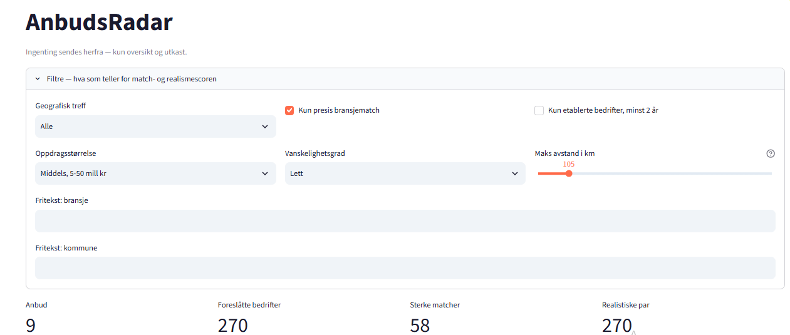

# AnbudsRadar

Finner offentlige anbud i Norge og matcher dem mot bedrifter som faktisk kan ta jobben. Bygget fordi små bedrifter sjelden har tid til å lete gjennom Doffin selv, og går glipp av anbud de kunne vunnet.



## Nøkkeltall

| | |
|---|---|
| Datakilder | 2 offentlige API-er, Doffin og Brønnøysundregisteret |
| Kobling anbudskode til næringskode | 60 håndlagde oppslag |
| Score per anbud og bedrift | 2 tall, begge fra 0 til 100 |
| Kodebase | ca. 1 500 linjer Python |
| Kostnad å drifte | 0 kr. Ingen betalte tjenester, ingen sky |

## Teknologi

Python og pandas for uthenting og scoring. Streamlit for dashbordet. Doffin og Brreg som datakilder. Offline postnummerdatasett for avstand. Språkmodell for å skrive e-postutkast. All data lagres som filer, ingen database.

## Slik virker det

1. Henter aktive anbud fra Doffin med frist, verdi, kontaktperson og bransjekode.
2. Henter norske småbedrifter fra Brreg, filtrert på ansatte og bransje.
3. Regner ut **matchscore** (treffer bransje og geografi) og **realismescore** (kan bedriften faktisk ta jobben, gitt størrelse, alder, avstand og tid til frist).
4. Viser alt i et dashbord med ferdige e-postutkast.

Ingenting sendes automatisk. E-postene er utkast du leser gjennom selv.

## Slik ble det bygget og verifisert

Bygget agentisk med Claude Code. Jeg bryter ned problemet, styrer implementasjonen og går gjennom det som kommer ut. Koden får ikke stå før jeg har sett den virke mot ekte data.

Det viktigste jeg fant ved å teste mot live data, ikke ved å lese kode:

* Det finnes ingen offisiell kobling mellom EUs anbudskoder (CPV) og norske næringskoder (NACE). Jeg bygde tabellen for hånd og justerte den mot ekte treff til feilmatchene forsvant. En gullsmed som fikk tilbud om et sykehjemsanbud var signalet på at den ikke var ferdig.
* Norge følger ikke EU-standarden for NACE. Bilbransjen er tydeligst: EU sier kode 45, Brreg bruker 46 og 47 for handel og 95 for verksted. Kode 45 ga null treff i hele Norge.
* Både Brreg og Doffin har tak på hvor dypt du kan søke, rundt 10 000 og 1 000 treff. Løst ved å dele søket automatisk på ansatte og publiseringsdato til hver bit er liten nok.

Avstand regnes med et gratis offline postnummerdatasett i stedet for en betalt geokodingstjeneste, fordi presisjon på postnummernivå er nok til å rangere. En egen logg sørger for at ingen bedrift kontaktes to ganger, uansett hvor mange ganger scriptet kjøres.

## Kjøre det

```bash
pip install -r requirements.txt

python doffin_fetch.py          # hent anbud, krever gratis Doffin-nøkkel
python brreg_fetch.py           # hent bedrifter, ingen nøkkel
python compute_scores.py        # regn ut score
python generate_email_drafts.py # skriv e-postutkast

streamlit run app.py            # åpne dashbordet
```
